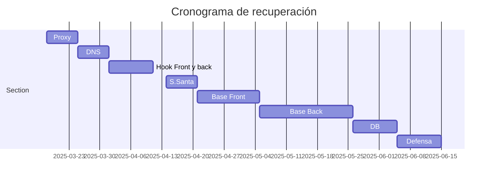

#curso24_25 #deapweb

# Evaluación EXTRAORDINARIA
(3a EVALUACIÓN)

El alumno deberá presentar y defender satisfactoriamente al menos el 80% de las prácticas, demostrando que es el autor de la misma[^2].

Estas prácticas deberán ser entregadas antes del 15 de mayo para establecer un calendario de defensa de las mismas.

Una vez superado el apartado de las prácticas, el alumno realizará un examen que abarcará todos los resultados de aprendizaje del curso.

El alumnado que así lo desee podrá sustituir el punto anterior mediante la realización de un trabajo que abarque todos los RA del curso. Concretamente, el trabajo consistirá en la realización de un programa de despliegue de una aplicación completa backend (Laravel) + frontend (Angular o similar) mediante las técnicas vistas a lo largo del curso, como: proxy, dns y despliegue continuo con hooks, y por supuesto mediante versionado por GIT.

Este trabajo se distribuirá según el siguiente cronograma:

| Tarea | F inicio   | F fin      |
|-------|------------|------------|
| Proxy | 18-03-2025 | 24-03-2025 |
| DNS   | 25-03-2025 | 31-03-2025 |
| Hook Front y back | 01-04-2025 | 11-04-2025 |
| S.Santa | 14-04-2025 | 21-04-2025 |
| Base Front | 22-04-2025 | 05-05-2025 |
| Base Back | 06-05-2025 | 26-05-2025 |
| DB    | 27-05-2025 | 05-06-2025 |
| Defensa | 06-06-2025 | 12-06-2025 |

---
# Impartido
---

## UT0. Herramientas y repaso
Duración: 4 h

+ 12s:
  + [x] Programación (previa)
  + [x] Control de versiones -> **GIT**
  + [x] Lenguaje de marcado ligero para representación -> **Markdown**
  + [x] Virtualización asistida -> **Vagrant**
+ 16s:
  + [x] Aclaraciones
  + [x] Ejercicios Vagrant
  + [x] Corrección práctica GIT.
  
        
*Git y Markdown asociados a RA6 y Vagrant asociado a RA1*.

## UT1. Implantación de arquitecturas web
Duración: 16 h

### Bases del despliegue:
CE: a, b, f.
+ 17s: 
  + [x] [Breve repaso de comandos linux](https://github.com/luiscastelar/clases24_25/blob/main/comun/linux%20CLI.md)
+ 19s:
  + [x] Arquitecturas web
  + Protocolos:
    + [x] Http
    + [x] Https

### Contenedores (“virtualización” ligera) -> **Docker**
CE: e, f, h, i.
+ 23s:
  + TCP/IP
      + [x] IPv4
      + [x] IPv6
  + `docker` CLI
    + [x] instalación
+ 24s:
  + cont CLI (hasta correr mysql)
    + [x] run, start, stop
+ 26s:
  + cont CLI
    + [x] estado
    + [x] De `-i` a `-d` y viceversa
    + [x] redes
    + [x] volúmenes
    + [x] tags
    + [x] `docker cp`
  + `docker compose`
    + [x] composerize
    + [x] versión sin `-` (guion o _dash_)
    + [x] comandos up, down, ps y log
    + [x] secretos y `.env`
+ 30s:
  + [x] Dudas docker cli
  + `Dockerfile` 
    + [x] Comandos `FROM`, `COPY` y `ENTRYPOINT`
    + [x] `docker build` y `docker tag`
    + [x] Comando `CMD` vs `ENTRYPOINT`
    + [x] Comando `ARG` vs `ENV`. 
+ 1o:
  + [x] Charla sobre el ruido ambiente
  + `Dockerfile`
    + [x] App Java _Stand-alone_
    + [x] Sustitución de archivos de configuración en caliente
+ 3o:
  + [x] Servidores: web, aplicaciones y vps
  + [x] `Dockerfile` optimizado en 2 etapas
  + [x] Docker hub
  + [x] Seguridad (no root)
  + [ ] Buenas prácticas
+ 14o:
  + [x] **Examen / Defensa [^1] de prácticas**
+ 15o:
  + [x] **Examen / Defensa de prácticas**

### Aplicación:
+ [x] Servidor web (c, f, h, i)
+ [x] Servidor de aplicaciones (d, f, h, i)
+ [x] Servidores en la nube (vps) (e, f, h, i)

### Tareas:
1. Documentar los procesos.
2. Implementar los procesos documentados por un compañero.

*Asociado al RA1*.

## UT2. Servidores WEB
Duración: 14 h
+ 7o: Apache
  + [x] Configuración avanzada del servidor web.
  + [x] Hosts virtuales. Creación, configuración y utilización.
+ 8o:
  + [x] Módulos: instalación, configuración y uso.
  + [x] Autenticación y control de acceso.
  + [x] Autenticación con `auth digest`.
+ 10o:
  + [x] El protocolo HTTPS.
  + [x] Certificados. Servidores de certificados.
  + [x] Documentación.
  + [x] Despliegue de aplicaciones sobre servidores web.
  + [x] Despliegue de servidores web mediante tecnologías de virtualización en la nube y en contenedores.
+ 17o:
  + [x] continuación configuración de `host` para acceso externo
+ 21o:
  + [x] Proxy
+ 22o: Implantación
  + [x] Apache
  + [ ] ~~`rsync`~~ -> problemas en windows -> Usar `rsync` desde `vagrant` o `wsl`.
+ 24o: 
  + [x] Monitorización
  + [ ] ~~Nginx~~
+ 28o: **Examen**
+ 29o:
  + [x] CORS
 
### Contenido
+ [x] Servidor web Apache (a, b, c, d, g, i)
+ [ ] ~~Servidor web Nginx (a, b, c, d, g, i)~~
+ [x] Proxy (e, f, g, i)
+ [ ] Implantación (local) aplicación Angular/React (h, i)
+ [x] Monitorización (j)

*Asociado al RA2*.

## UT3. Servidor de aplicaciones
Duración: 12h -> 30o a 13n

+ 29o:
  + [x] JakartaEE
+ 31o:
  + [x] JakartaEE
+ 4n:
  + [x] Laravel
  + [x] JakartaEE
+ 5n:
  + [x] Node.js
  + [x] Flask
+ 17n: **Entrega PRÁCTICAS** <u>antes</u> de la 13.00 h.
+ 18n: **Defensa**
+ 19n: **Defensa**
+ 21n: **Defensa**

### Contenido:
+ [x] Contenedor de aplicaciones Tomcat (a, b, c, d, e, h, i)
+ [x] Despliegue de aplicación web Servlet/Spring/Quarkus (f, g, h, i)

*Asociado al RA3*.

## UT4. Gestión de servidores y archivos
Duración: 11 h -> 13n a 27n
+ 7n:
  + [x] FTP (a, b, c, d, g)
  + [x] Acceso remoto seguro - SSH (e, g)  + [ ] 
  + [x] Bastionado SSH:
     + [x] pares de llaves
     + [x] fail2ban
+ 11n:
  + [x] fail2ban
  + [x] Repositorios BARE (f, g, h)
  + [ ] ~~Hooks locales (CI/CD)~~
  + [x] Hooks remotos (CI/CD)
+ 12n:
  + [x] cont Bare y Hooks (CI/CD)
+ 14n:
  + cont Bare y Hooks (CI/CD)
+ 21n: **Defensa prácticas**
+ 28n: **Defensa prácticas**
  
*Asociado a los RA4 y RA6*.

## UT5. Servicios de red
Duración: 7 h -> 27n a 4d
+ 26n: 
  + [x] DNS (a, b, g, h)
  + [x] LDAP (c, d, g, h)
+ 28n:
  + [x] cont DNS y LDAP
+ 3d: 
  + [x] nginx con autenticación LDAP (e, f, g, h)
+ 5d:
  + [x] cont nginx con autenticación
+ ~~10d:~~
        
*Asociado a RA5*.

---
## Repaso y evaluación
+ Del 2 al 10 de diciembre: Repaso del curso
+ 12d: **Recuperación evaluación**
+ 16d: **Defensa practicas** pendientes
+ 17d: **Defensa practicas** pendientes

---

## Cronograma:
+ 9 enero de 2025:
  + [x] **Maven**

## Proyecto integrador:
### Alumnos Dual (16h)
Despliegue de una aplicación web (front, back y persistencia) sobre nube pública o vps accesible públicamente desde internet.

### Alumnos NO Dual (40h)
+ 13 enero:
  + [x] Generación automática de web documental desde markdown
  + [x] BBDD relacional vs documental
+ 14 enero:
  + [x] Sensores de temperatura/humedad DHT11 y LM35
  + [x] Firewall de servidor de despliegue (MySQL)
+ 16 enero:
  + [x] Kanban en GitHub. Metodología y documentación.
  + [x] Polarización de sensores DHT11 (R4k7)
        
+ 20 enero:
  + [x] revisión de issues
  + [x] ajustes de despliegue de la bbdd
+ 21 enero:
  + [x] herramientas de desarrollo sobre servidor tras firewall
  + [x] verificar configuración de bbdd (usr y pass random y en archivo .env).
  + [x] **Aviso de faltas de asistencia**: Aquel alumno que no alcance el 90% de presencialidad de las horas asignadas al proyecto grupal (40h) tendrá que demostrar la superación de los RA de este módulo de forma escrita.
+ 23 enero:
  + [x] Ver config en repo de bbdd
  + [x] Ver opciones y requisitos de despiegue
 
+ 27 enero:
  + [x] Conexión backend - bbdd
+ 28 enero:
  + [x] Conexión backend - bbdd.
+ 30 enero:
  + [x] Depueración de problemas en renderizado de gráficas (angular)
  
+ 3 febrero:
  + [x] Conexión ssh a máquina de despliegue
+ 4 febrero:
  + [x] Conexión ssh a máquina de despliegue
+ 6 febrero:
  + [x] Documentación del despliegue
  + [x] Análisis del despliegue
  
+ 10 febrero:
  + [x] Avances del despliegue y su documentación.
  + [x] Ajuste de latidos de cron
+ 11 febrero:
  + [x] Documentación y estructura de la misma
+ 13 febrero:
  + [x] Revisión de documentación del despliegue
 
+ 17 feb:
  + [x] El archivo .htaccess para ajuste de cache en desarrollo y produción.
+ 18 feb:
  + [x] Revisión de documentación del despliegue
+ 20 feb:
  + [x] Revisión de documentación del despliegue

+ 24 feb:
  + [x] Revisión de servidores de despliegue. Problemas de puertos.
+ 25 feb:
  + [x] Revisión de servidores de despliegue. Problemas de certificados.
+ 27 feb:
  + [x] Resolución de dudas

+ ~~3 marz: Carnavales~~
+ ~~4 marz: Carnavales~~
+ 6 marz:
  + [x] **Entrega y defensa de la puesta en producción** (RA1-5)
  + [x] **Entrega y defensa de la generación automática de documentación** (RA6)
+ 10 marz:
  + [x] Presentación de trabajo del alumnado de dual
+ 11 marz:
  + [x] Defensa de trabajos de despliegue del alumnado de dual
+ 13 marz: 
  + **Examen ORDINARIA**:
    + Crear y desplegar:
    + [RA2] una aplicación Laravel (un hola mundo)
    + [RA1 y RA2] a través de docker
    + [RA4] con sincronización de archivos mediante hook
    + [RA2] desplegado en un servidor público
    + [RA5] con nombre (Duckdns o similar) y tras un proxy inverso
   
  + [x] Defensa de trabajos de despliegue del alumnado de dual

#### Parcial
Despliegue de aplicaciones web (front, back y persistencia) sobre nube pública o vps accesible públicamente desde internet:
+ Front:
  + Vanilla (Html5 + JS + Ajax)
  + Laravel
  + Angular
  + React
  + Otra
+ Back:
  + Servlet
  + Laravel
  + Spring
  + Quarkus
  + Node.js
  + Otra
+ Persistencia:
  + Mysql
  + PostgreSQL
  + Firebase
  + Supabase
  + Otra

**Duración: 100 horas.**

---

# Contenidos mínimos:
+ [x] Sitios web estáticos y dinámicos.
+ [x] Aplicaciones web.
+ [x] Servicios web.
+ [x] Servidores de nombres. Tipos.
+ [x] Registros DNS.
+ [x] Zona directa e inversa.
+ [x] Servidores web. Instalación.
+ [x] Ficheros y parámetros de configuración de servidores.
+ [x] Servidores virtuales.
+ [x] Establecimiento de conexiones seguras HTTPS.
+ [x] Configurando CORS.
+ [x] Instalación y funcionamiento de sFTP.
+ [x] Git. Funcionamiento.
+ [x] Git. Trabajo con ramas y en remoto.
+ [x] Git BARE.
+ [x] CI/CD con hooks de Git
+ [x] Docker. Instalación y componentes.
+ [x] Docker. Ciclo de vida de los contenedores.
+ [x] DockerFile y DockerCompose.
+ [x] JavaEE y JakartaEE.
+ [x] Servidor/Contenedor de aplicaciones (Tomcat).
+ [x] Despliegue de aplicaciones en un entorno de red en un servidor Linux.
+ [x] Despliegue en la nube.

# Notas al pie:
[^1]: Aunque de forma general está programado un examen, si el alumno o alumna ha facilitado el proceso de enseñanza-aprendizaje no molestando a los compañeros, este examen podrá ser sustituido por la defensa de las práctica.

[^2] Suponemos que es el autor de las mismas cuando es capaz de explicar el motivo por el que realiza los distintos pasos de los procesos, así como el origen de TODAS las palabras utilizadas en la documentación y el desarrollo.
