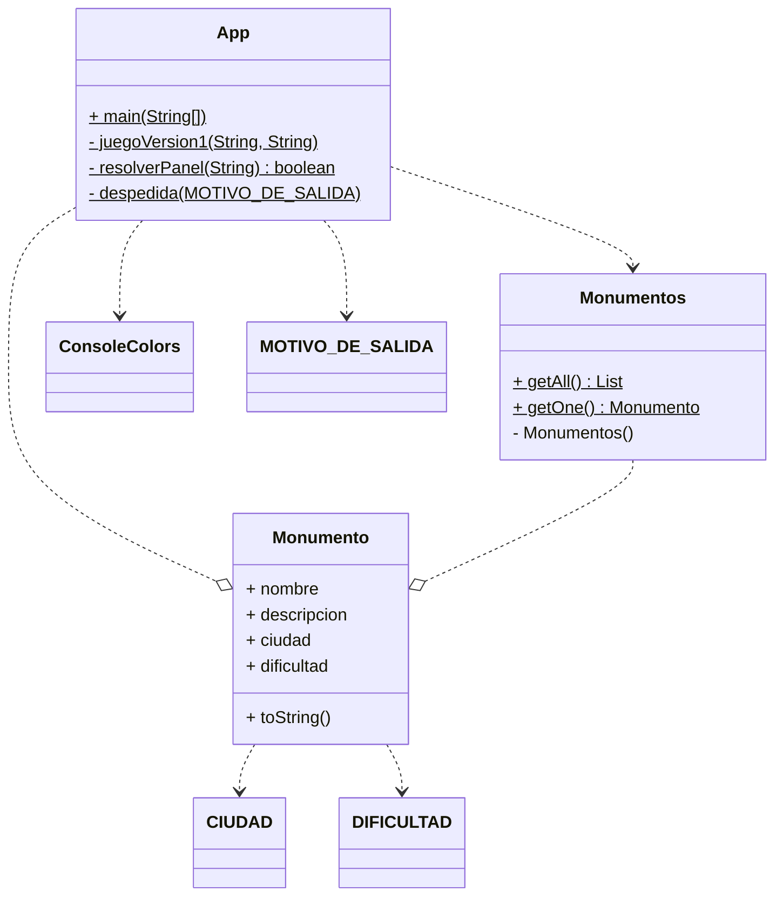

#curso24_25 #prog

# Versión: PRIMERA EVALUACIÓN
Conocido el famoso juego de televisión “La ruleta de la suerte”, queremos implementar dicho juego en primera aproximación de forma sencilla.

Primero deberemos [generar entre todos](https://forms.gle/r1DmTGsvjWpHcUiTA) una base de datos de monumentos de Extremadura.

Luego, partiremos del análisis de requisitos previos que desembocan en el siguiente diagrama de clases:

## Clase APP:
Deberemos implementar 4 métodos principales que nos aporten las funcionalidades principales:
+ main():
  1. Arranca nuestra aplicación.
  2. Obtienes un monumento.
  3. Genera los paneles.
  4. Arranca la mecánica del juego.
  5. Despide al usuario.
+ juegoVersion1():
  1. Inicializa constantes y número de vidas
  2. Bucle del juego, mientras tengamos vidas:
     + Captura letra o comando
       + Si es comando llama a operación correspondiente (es flexible y ampliable).
         + Si “SALIR” => salir con motivo “SALIR”
         + Si “RESOLVER” => llamar a resuelvePanel()
       + Si es letra: Buscar si el panel contiene letra
         + Si contiene:
           + voltear letras (las descubrimos).
           + Si panel visto es igual al oculto => salir con motivo “GANADOR”
         + Si no: restar vida. Si no quedan => salir con motivo “SIN_VIDAS”.
+ resuelvePanel():
  1. Pedir frase
  2. Comprobar si frases son iguales
     + Si lo son => salir con motivo “GANADOR”
     + Si no lo son => restar vida
+ despedida(): Recibe el motivo y se despide.


## Clases auxiliares:
+ Monumento: se implementará como registro.
+ CIUDAD: será un _enum_ con las ciudades de los monumentos. En esta primera aproximación no será de utilidad, pero en futuras sí ya que nos permitirá acotar la geografía.

  Posibles valores: BADAJOZ, MERIDA, CACERES, DON_BENITO
  
+ DIFICULTAD: será un _enum_. Misma aproximación que con CIUDAD.

  Posibles valores: FACIL, MEDIA, DIFICIL, EXTREMA
  
+ MOTIVO_DE_SALIDA: será un _enum_ para acotar los motivos por los que se abandona el juego (GANADOR, SALIR, SIN_VIDAS, DESCONOCIDO).
+ ConsoleColors: es una clase con las posibles combinaciones para “endulzar” la salida de consola.
+ Monumentos: es una clase DAO[^1] que nos realizará las funciones de proxy (intermediario) entre la clase consumidora y los datos.

  Nos ofrece los métodos `List<Monumento> getAll()` y `Monumento getOne()`.

### ConsoleColors.java
<details>
  <summary>Implementación:</summary>
  
```java
package RuletaDeLaSuerte;

public class ConsoleColors {
    // Reset
    public static final String RESET = "\033[0m";  // Text Reset

    // Regular Colors
    public static final String BLACK = "\033[0;30m";   // BLACK
    public static final String RED = "\033[0;31m";     // RED
    public static final String GREEN = "\033[0;32m";   // GREEN
    public static final String YELLOW = "\033[0;33m";  // YELLOW
    public static final String BLUE = "\033[0;34m";    // BLUE
    public static final String PURPLE = "\033[0;35m";  // PURPLE
    public static final String CYAN = "\033[0;36m";    // CYAN
    public static final String WHITE = "\033[0;37m";   // WHITE

    // Bold
    public static final String BLACK_BOLD = "\033[1;30m";  // BLACK
    public static final String RED_BOLD = "\033[1;31m";    // RED
    public static final String GREEN_BOLD = "\033[1;32m";  // GREEN
    public static final String YELLOW_BOLD = "\033[1;33m"; // YELLOW
    public static final String BLUE_BOLD = "\033[1;34m";   // BLUE
    public static final String PURPLE_BOLD = "\033[1;35m"; // PURPLE
    public static final String CYAN_BOLD = "\033[1;36m";   // CYAN
    public static final String WHITE_BOLD = "\033[1;37m";  // WHITE

    // Underline
    public static final String BLACK_UNDERLINED = "\033[4;30m";  // BLACK
    public static final String RED_UNDERLINED = "\033[4;31m";    // RED
    public static final String GREEN_UNDERLINED = "\033[4;32m";  // GREEN
    public static final String YELLOW_UNDERLINED = "\033[4;33m"; // YELLOW
    public static final String BLUE_UNDERLINED = "\033[4;34m";   // BLUE
    public static final String PURPLE_UNDERLINED = "\033[4;35m"; // PURPLE
    public static final String CYAN_UNDERLINED = "\033[4;36m";   // CYAN
    public static final String WHITE_UNDERLINED = "\033[4;37m";  // WHITE

    // Background
    public static final String BLACK_BACKGROUND = "\033[40m";  // BLACK
    public static final String RED_BACKGROUND = "\033[41m";    // RED
    public static final String GREEN_BACKGROUND = "\033[42m";  // GREEN
    public static final String YELLOW_BACKGROUND = "\033[43m"; // YELLOW
    public static final String BLUE_BACKGROUND = "\033[44m";   // BLUE
    public static final String PURPLE_BACKGROUND = "\033[45m"; // PURPLE
    public static final String CYAN_BACKGROUND = "\033[46m";   // CYAN
    public static final String WHITE_BACKGROUND = "\033[47m";  // WHITE

    // High Intensity
    public static final String BLACK_BRIGHT = "\033[0;90m";  // BLACK
    public static final String RED_BRIGHT = "\033[0;91m";    // RED
    public static final String GREEN_BRIGHT = "\033[0;92m";  // GREEN
    public static final String YELLOW_BRIGHT = "\033[0;93m"; // YELLOW
    public static final String BLUE_BRIGHT = "\033[0;94m";   // BLUE
    public static final String PURPLE_BRIGHT = "\033[0;95m"; // PURPLE
    public static final String CYAN_BRIGHT = "\033[0;96m";   // CYAN
    public static final String WHITE_BRIGHT = "\033[0;97m";  // WHITE

    // Bold High Intensity
    public static final String BLACK_BOLD_BRIGHT = "\033[1;90m"; // BLACK
    public static final String RED_BOLD_BRIGHT = "\033[1;91m";   // RED
    public static final String GREEN_BOLD_BRIGHT = "\033[1;92m"; // GREEN
    public static final String YELLOW_BOLD_BRIGHT = "\033[1;93m";// YELLOW
    public static final String BLUE_BOLD_BRIGHT = "\033[1;94m";  // BLUE
    public static final String PURPLE_BOLD_BRIGHT = "\033[1;95m";// PURPLE
    public static final String CYAN_BOLD_BRIGHT = "\033[1;96m";  // CYAN
    public static final String WHITE_BOLD_BRIGHT = "\033[1;97m"; // WHITE

    // High Intensity backgrounds
    public static final String BLACK_BACKGROUND_BRIGHT = "\033[0;100m";// BLACK
    public static final String RED_BACKGROUND_BRIGHT = "\033[0;101m";// RED
    public static final String GREEN_BACKGROUND_BRIGHT = "\033[0;102m";// GREEN
    public static final String YELLOW_BACKGROUND_BRIGHT = "\033[0;103m";// YELLOW
    public static final String BLUE_BACKGROUND_BRIGHT = "\033[0;104m";// BLUE
    public static final String PURPLE_BACKGROUND_BRIGHT = "\033[0;105m"; // PURPLE
    public static final String CYAN_BACKGROUND_BRIGHT = "\033[0;106m";  // CYAN
    public static final String WHITE_BACKGROUND_BRIGHT = "\033[0;107m";   // WHITE
}
```

</details>

---
# Notas al pie:
[^1]: [DAO es un patrón de diseño](https://www.oscarblancarteblog.com/2018/12/10/data-access-object-dao-pattern/) que nos permite aislar el acceso de nuestra clase a los datos de la tecnología utilizada para almacenarlos/recuperarlos. En otras palabras, nos aporta una interfaz idéntica para todas las implementaciones de forma que podamos cambiar la persistencia de los datos sin cambiar nuestra aplicación.